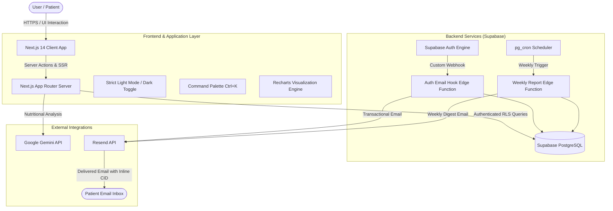

# 🩺 Gluvia — South Asian Diabetes & Glycemic Management Platform

> **🎓 Final Year Project (FYP)**  
> **Author & Developer:** Zarak K.  
> **Live Production:** [gluvia.world](https://www.gluvia.world)  
> **Tech Stack:** Next.js 14 (App Router) · TypeScript · Tailwind CSS · Supabase · PostgreSQL · Google Gemini AI · Resend API · Deno Edge Functions

---

[](https://nextjs.org/)
[](https://www.typescriptlang.org/)
[](https://tailwindcss.com/)
[](https://supabase.com/)
[](https://ai.google.dev/)
[](https://resend.com/)

---

## 📖 About The Project (Final Year Project)

**Gluvia** is developed as a comprehensive **Final Year Project (FYP)** designed to bridge the critical gap in personalized digital metabolic health management for South Asian populations.

### 🎯 Problem Statement
South Asians have a **4–6x higher genetic predisposition** to developing Type 2 diabetes compared to other ethnic groups, frequently manifesting the disease at a younger age and lower BMI. Mainstream western health applications evaluate meals and glucose spikes against Western dietary models, providing little practical utility for traditional South Asian diets rich in complex carbohydrates and culinary staples (roti, parathas, white rice, daal, biryani, and sweetened chai).

### 💡 The Solution
Gluvia delivers a culturally tuned, clinical-grade digital health companion that:
1. **Calibrates Glycemic Context:** Evaluates glucose responses relative to traditional South Asian meal compositions and cultural eating timings.
2. **Deploys Clinical-Grade Intelligence:** Uses Google Gemini AI fine-tuned with nutritional knowledge to recommend culturally authentic ingredient swaps, portion calibrations, and glucose mitigation strategies without alienating cultural heritage.
3. **Automates Preventive Care:** Employs serverless background workers to deliver comprehensive weekly digests, doctor consultation export summaries, and real-time glycemic trajectory analytics.

---

## 🚀 Key Features

### 🩸 1. Glycemic Logging & Intelligent Categorization
* Single-click rapid blood glucose logging with context tags: `Fasting`, `Before Meal`, `After Meal`, and `Bedtime`.
* Automatic clinical threshold segmentation:
  * **Low:** `< 70 mg/dL`
  * **Optimal / Normal:** `70 – 139 mg/dL`
  * **Elevated:** `140 – 199 mg/dL`
  * **High:** `≥ 200 mg/dL`
* Meal logging with traditional South Asian carbohydrate profiling and note attribution.

### 📊 2. Clinical Analytics & Trajectory Visualizations
* Interactive time-series charts powered by **Recharts** displaying 7-day, 30-day, and 90-day glycemic trajectories.
* In-range percentage metrics, estimated A1c correlation indicators, mean glucose calculations, and standard deviation fluctuation alerts.

### 🤖 3. Google Gemini AI Glycemic Assistant
* Interactive, floating metabolic chat companion trained on South Asian dietetics and clinical diabetes guidelines.
* Instant, contextual meal analysis (e.g., assessing the glycemic impact of daal chawal, paratha, or traditional desserts like gulab jamun, with practical mitigation tips like fiber sequencing and portion balance).

### 📬 4. Automated Weekly Health Report Engine
* Autonomous cron engine running on **Supabase Edge Functions (Deno / TypeScript)**.
* Compiles 7-day statistical digests and dispatches personalized emails via the **Resend API**.
* Engineered with PostgreSQL transactional idempotency to guarantee zero duplicate emails.
* Uses Base64 inline MIME CID attachments (`cid:gluvia-logo`) ensuring 100% email client render fidelity without remote image blocking.

### 📑 5. Doctor Consultation Summaries
* Exportable, structured clinical reports formatted for endocrinologists and general physicians.
* Bridges the patient-provider communication gap with clear trend tables, averages, and meal-spike correlations.

### 🎨 6. Medical Design System & Accessibility
* Clean, distraction-free clinical UI engineered with Tailwind CSS and Radix UI primitives.
* **Strict Light Mode default** with an instant, persistent zero-flicker **Dark Mode toggle**.
* Fast keyboard navigation via a global **Command Palette** (`Ctrl + K`).

### 🛡️ 7. Enterprise-Grade Security
* **Scanner-Proof Password Recovery:** Custom authentication pipeline resilient against enterprise email virus scanners (Microsoft Defender, Safelinks) that consume single-use OTP tokens.
* Complete multi-tenant isolation via **Supabase Row Level Security (RLS)** policies.

---

## 🏗️ System Architecture



---

## 🛠️ Tech Stack & Technologies

| Category | Technology | Purpose |
|---|---|---|
| **Core Framework** | **Next.js 14.2 (App Router)** | Hybrid Server & Client Component rendering, Server Actions |
| **Language** | **TypeScript 5.4** | 100% Strict Type Safety across entire codebase |
| **Styling & UI** | **Tailwind CSS 3.4**, **Radix UI** | Accessible, custom medical-grade design tokens |
| **Icons** | **Lucide React** | Consistent clinical iconography |
| **Charts & Graphs** | **Recharts 2.12** | Smooth, interactive glycemic trajectory charts |
| **Forms & Validation** | **React Hook Form**, **Zod** | Client and server-side schema verification |
| **State Management** | **Zustand** | Lightweight client-side application state |
| **Database & Auth** | **Supabase (PostgreSQL)** | Relational data persistence, Row Level Security (RLS) |
| **Edge Functions** | **Deno / TypeScript** | Serverless background workers for cron jobs and email hooks |
| **Artificial Intelligence**| **Google Gemini API** | Contextual nutritional & metabolic AI assistant |
| **Email Infrastructure**| **Resend API** | Transactional emails and weekly statistical reports |
| **Deployment** | **Vercel** | Edge network deployment, CI/CD pipeline |

---

## 📁 Project Directory Structure

```
Gluvia/
├── app/                          # Next.js 14 App Router routes & layouts
│   ├── (auth)/                   # Authentication flows (login, register, forgot-password, update-password)
│   ├── (dashboard)/              # Core application pages (overview, logs, analytics, reports, settings)
│   ├── api/                      # Next.js API route handlers (Gemini AI proxy, health checks)
│   ├── globals.css               # Global styling, Tailwind directives & CSS variable tokens
│   ├── layout.tsx                # Root layout with theme initialization
│   └── page.tsx                  # Public landing page
├── components/                   # Reusable UI & domain components
│   ├── analytics/                # Recharts trend curves, stats summaries, distribution cards
│   ├── assistant/                # Floating Gemini AI conversational drawer & chat widget
│   ├── auth/                     # Auth forms & password recovery views
│   ├── layout/                   # TopBar (theme toggle), SideBar, CommandPalette (Ctrl+K)
│   ├── logs/                     # Glucose logging forms, table views, filtering controls
│   └── ui/                       # Radix UI primitives (dialog, button, select, tabs, sonner)
├── docs/                         # Architecture documentation & email system setup guides
├── hooks/                        # Custom React hooks (useTheme, useMediaQuery, etc.)
├── lib/                          # Utility functions, Supabase clients (browser/server), validators
├── store/                        # Zustand global stores
├── supabase/                     # Supabase local config & serverless edge functions
│   ├── functions/
│   │   ├── auth-email-hook/      # Custom password reset & welcome email hook via Resend
│   │   └── weekly-health-report/ # Idempotent cron job generating weekly glycemic digests
│   └── migrations/               # PostgreSQL schema, RLS policies, tables & triggers
├── types/                        # Global TypeScript interfaces & database definitions
└── public/                       # Static branding assets, icons, and illustrations
```

---

## ⚙️ Getting Started (Local Setup)

### 1. Prerequisites
Ensure you have the following installed on your machine:
* **Node.js**: `v18.17.0` or higher
* **npm**: `v9.0.0` or higher
* **Git**

### 2. Clone the Repository
```bash
git clone https://github.com/your-username/gluvia.git
cd gluvia
```

### 3. Install Dependencies
```bash
npm install
```

### 4. Configure Environment Variables
Create a `.env.local` file in the root directory by duplicating `.env.local.example`:

```bash
cp .env.local.example .env.local
```

Populate the required environment variables:

```env
# Supabase Configuration
NEXT_PUBLIC_SUPABASE_URL=https://your-project.supabase.co
NEXT_PUBLIC_SUPABASE_ANON_KEY=your-supabase-anon-key

# Site URL (for redirection & production)
NEXT_PUBLIC_SITE_URL=http://localhost:3000

# Google Gemini AI Key
GEMINI_API_KEY=your-gemini-api-key
```

### 5. Run the Local Development Server
```bash
npm run dev
```

Open [http://localhost:3000](http://localhost:3000) in your browser to experience Gluvia locally.

### 6. Build for Production
To create an optimized production build:
```bash
npm run build
npm run start
```

---

## 🧪 Supabase Edge Functions Deployment

Gluvia leverages two serverless Deno Edge Functions in the `supabase/functions/` directory:

1. **`auth-email-hook`**: Replaces Supabase's default mailer with custom-designed, branded Resend emails for password reset and onboarding.
2. **`weekly-health-report`**: Triggered via cron to aggregate 7-day readings and email users their glycemic report card.

Deploy via the Supabase CLI:
```bash
# Link your project
npx supabase link --project-ref your-project-ref

# Deploy functions
npx supabase functions deploy auth-email-hook --no-verify-jwt
npx supabase functions deploy weekly-health-report --no-verify-jwt

# Set Edge Function Secrets
npx supabase secrets set RESEND_API_KEY="your-resend-key"
npx supabase secrets set RESEND_FROM_EMAIL="reports@gluvia.world"
npx supabase secrets set RESEND_FROM_NAME="Gluvia"
npx supabase secrets set APP_URL="https://www.gluvia.world"
```

---

## 🎓 Academic / FYP Highlights & Contributions

* **Domain-Specific Healthcare Adaptation:** Rather than a generic CRUD fitness tracker, the project tackles an acknowledged clinical problem: the South Asian diabetes paradox.
* **Complex State & Serverless Architecture:** Implements a decoupled event-driven system linking client-side SSR/SPA architecture with edge compute workers, background cron jobs, and third-party AI APIs.
* **Security & Reliability Engineering:** Solved real-world production vulnerabilities including email pre-fetch OTP destruction, multi-tenant database isolation (PostgreSQL RLS), and idempotent job execution.

---

## 👤 Author & Acknowledgments

* **Developer:** Zarak K.
* **Project Type:** Final Year Project (FYP) / Capstone Project
* **Live Application:** [Gluvia Portal](https://www.gluvia.world)

---

## 📄 Disclaimer
*Gluvia is developed for educational, informational, and self-monitoring purposes as part of an academic Final Year Project. It does not replace professional medical diagnosis, advice, or treatment by a qualified healthcare provider.*
